Systems Engineer focused on building scalable, enterprise-grade applications. I work across the stack: Angular and React on the frontend; Java/Spring Boot, Python/Django and Node.js/NestJS on the backend; deployed on GCP and AWS, with Power BI and Power Platform for business intelligence.

<table>
  <thead>
    <tr><th align="left">Area</th><th align="left">Stack</th></tr>
  </thead>
  <tbody>
    <tr>
      <td><b>Frontend</b> Modern, responsive web applications</td>
      <td> PrimeNG · Angular Material</td>
    </tr>
    <tr>
      <td><b>Backend</b> Scalable APIs and microservices</td>
      <td> Django REST Framework · Celery</td>
    </tr>
    <tr>
      <td><b>Databases</b> Relational and NoSQL data modeling</td>
      <td> SQL Server</td>
    </tr>
    <tr>
      <td><b>Cloud & DevOps</b> Deployment and infrastructure</td>
      <td></td>
    </tr>
    <tr>
      <td><b>Business Intelligence</b> Reporting and process automation</td>
      <td>Power BI · Power Apps · Power Automate</td>
    </tr>
  </tbody>
</table>

